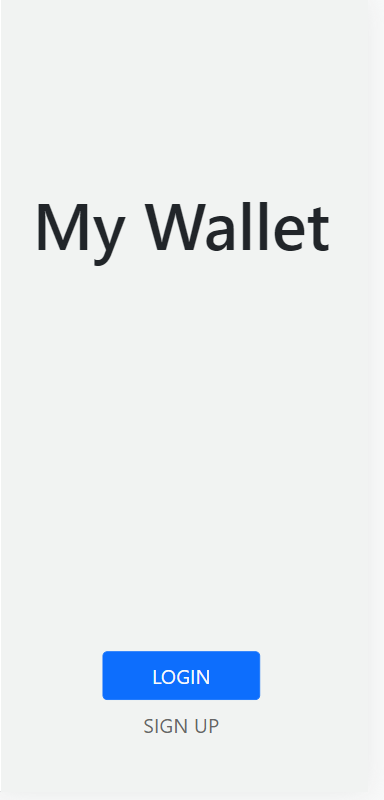
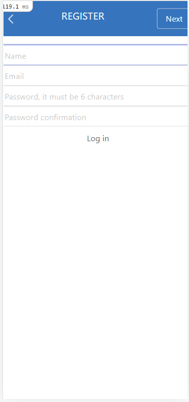
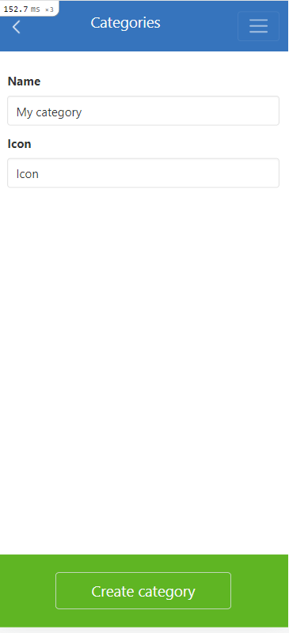
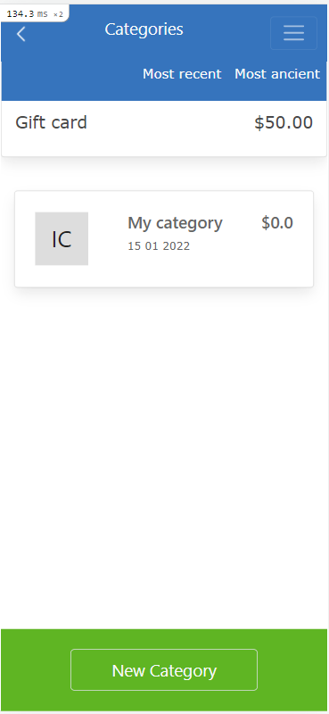
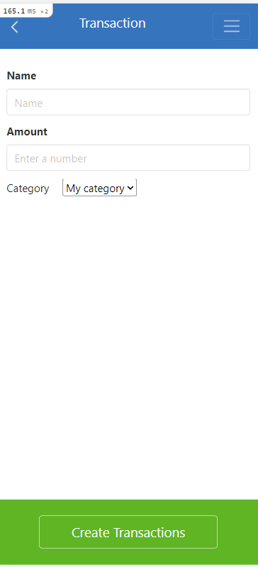
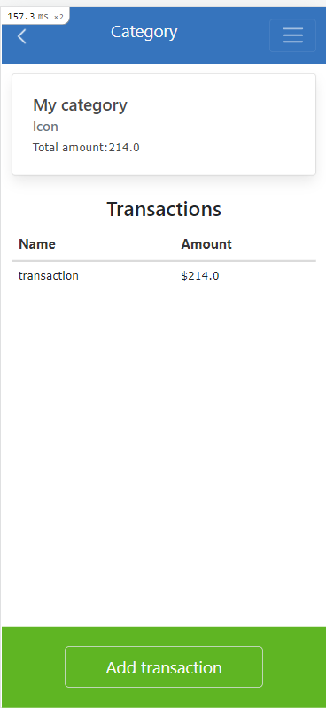
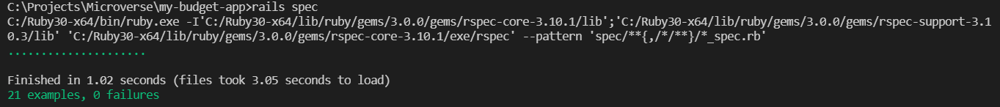

  <a href="https://www.microverse.org/">
    
  </a>

# My Budget App

My Budget App is a capstone project from the fifth module of the Microverse program. With it, we learned how to build applications using the Ruby on Rails framework.

Budget App is a  application that lets you create a user, log in, so that the data is private to them. In this application you will be introduced to your new transactions associated with a category and see the money spent on each category.


Everything will be based on the ERD class diagram presented below. 

</br>
 <div align="center">
    
    <p>Entity Relationship Diagram (ERD) of Budget App project</p>
</div>

## [Live demo](https://shrouded-sea-17784.herokuapp.com/)

   
   


## Getting Started
To run the project locally, copy up and running follow these simple example steps :

 - First of all make sure you have both `Ruby` & `Rails` installed in your machine
 (else You can install `Rails` just with this simple command  ```gem install rails```)
 - clone the project with the following command line : 
```
$ git clone git@github.com:Hamzaoutdoors/BLog_app.git
```
 - Then go to the right folder 
```
$ cd Blog_app
```
```
$ bundle
```
and run to install npm package
```
$ npm install
```

make sure the database is up and running.
```
$ rails db:create
```
When you will add migration file then, you can add command like
```
$ rails db:migrate
```

 - Finaly run `rails s` and visit http://localhost:3000/  in your browser!

 ## Run tests :

 To run Request specs locally you need just to run this following command in your terminal :

 ```
 $ bundle exec rspec
 ```
 </br>
 <div align="center">
    <kbd>
    
    <p>30 Request Specs passed</p>
       </kbd>
</div>

## Built With

 - Ruby on Rails  
 - PostgreSQL 
 
</br>

## Author

👤 **Laylo Khodjaeva**

- GitHub: [@Laylo309](https://github.com/Laylo309)
- Twitter: [@Laylo](https://twitter.com/home?lang=en)
- LinkedIn: [LayloKhodjaeva](https://www.linkedin.com/in/laylo-khodjaeva-05a972207/)

## 🤝 Contributing

Contributions, issues, and feature requests are welcome!

Feel free to check the [issues page](https://github.com/Laylo309/Recipe-app/issues).

## Show your support

Give a ⭐️ if you like this project!

## Acknowledgments

- Original design idea by [Gregoire Vella on Behance](https://www.behance.net/gregoirevella)
- Inspiration 💘
- Microverse program ⚡
- My standup team 😍
- My family's support 🙌

## 📝 License

This project is [MIT](https://github.com/Hamzaoutdoors/Blog_app/blob/dev/LICENSE.md) licensed.
